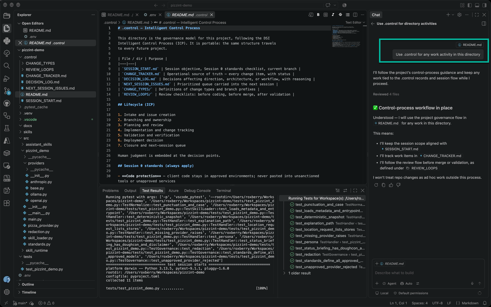
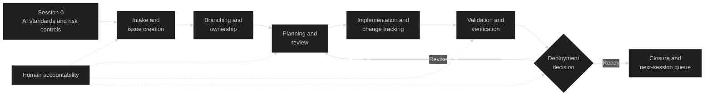

Question posed to the consultants @DSI - "Interested in hearing who's been using AI to assist with development and which platforms you've gained confidence in."  I replied with a summary of how I am using AI, but I decided to write a post of my process, and hopefully a process our clients and our clients can adopt.

Disclaimer: It's a work in progress, we may have better tools and solutions in the future.  The emphasis is on human responsibility and risk management.

[Intelligent Control Process Presentation](/presentations/Intelligent_Control_Process.pdf)

View an implementation of the paired-repository control process: [pizzint-demo](https://github.com/roxatdsi/pizzint-demo) and [pizzint-demo.control](https://github.com/roxatdsi/pizzint-demo.control)



## Control Should Improve Delivery, Not Slow It Down

AI-assisted delivery can make a team faster, but speed without structure creates a different class of risk. Work begins before its purpose is captured. Review feedback disappears into chat history. Decisions are made without preserving the reasoning behind them. Tests prove the happy path while recovery remains undefined. A session ends, and the next person has to reconstruct its state from fragments.

The **Intelligent Control Process** is an operating model for preventing that drift. It connects intake, planning, implementation, review, testing, deployment, and closeout through a small set of explicit artifacts and decision points.

The objective is not control for control's sake. It is decision-aware, traceable, and reviewable delivery.

The process assumes that AI can participate throughout the lifecycle: organizing work, drafting plans, implementing changes, generating tests, reviewing code, and summarizing results. It also assumes that AI does not own the outcome. Human judgment remains embedded at the points where scope, risk, architecture, readiness, and operational consequences are decided.

## Session 0 Comes Before the Workflow

The process begins before the first issue is created or the first branch is opened.

**Session 0** defines the AI usage standards and risk controls that apply to every later session. These are project constraints, not optional prompt guidance.

### Protect Code and Client Information

Client code must remain in approved environments. It should never be pasted into an unsanctioned service simply because that service is convenient or currently popular.

Credentials, API keys, connection strings, tenant information, client identifiers, and other sensitive values must be removed before any prompt, upload, or model call. Secrets redaction is a precondition for using AI, not a cleanup task after exposure.

### Use Approved Providers

The project determines which model providers and endpoints are acceptable. Private or enterprise services may be approved while consumer browser tools are prohibited. Model selection follows the project standard rather than personal preference or whatever tool happens to be available.

Client security requirements, contractual obligations, and applicable regulations always take precedence over process defaults.

These rules establish the outer boundary. The rest of the Intelligent Control Process governs what happens inside it.

## The Process Spans the Full Lifecycle

The lifecycle has seven connected stages:

1. Intake and issue creation.
2. Branching and ownership.
3. Planning and review.
4. Implementation and change tracking.
5. Validation and verification.
6. Deployment decision.
7. Closure and next-session queue.

The stages create continuity, but the decision gates create control.



Human oversight is not a final approval step appended to an otherwise autonomous process. It appears throughout the lifecycle. People decide what should be done, whether the proposed approach is appropriate, what evidence is sufficient, and whether operational risk is acceptable.

## Intake Creates Traceability Before Implementation

Every session starts with an objective and a change list. Before implementation begins, the team creates a working branch from `main` and associates the work with an issue in the relevant Issue Tracker.

Branch names communicate intent:

- `feature/` for new capabilities,
- `fix/` for corrections,
- `docs/` for documentation, and
- `chore/` for maintenance work.

When a change identifier exists, the branch should include the primary `CHG` ID.

The Issue Tracker is the umbrella system used to record and coordinate the work. Depending on the project, that may be GitHub, TeamCity, or a custom issue or ticket system. The process does not depend on one vendor; it depends on one authoritative record.

Before coding:

1. Check whether the work is already represented in the tracker.
2. Create an issue if no appropriate record exists.
3. Link the issue from the change tracker.
4. Record whether the issue was existing or newly created.
5. Assign a human owner.

A minimal record might include:

```yaml
issue: "#123"
issue_source: created
owner: "@github-handle"
```

This is the intake gate. The team establishes traceability and ownership before generating implementation momentum.

## The Change Tracker Is the Operational Source of Truth

Issue systems are necessary, but a focused delivery session also needs a compact operational view. The change tracker provides it.

Each tracked item records:

- identifier,
- change description,
- type,
- priority,
- status,
- dependencies,
- linked issue,
- issue source,
- owner, and
- working notes.

The status model remains intentionally small:

| Status | Meaning |
| ---------- | ---------- |
| `proposed` | Identified but not selected for current execution. |
| `active` | Approved and currently being implemented. |
| `review` | Implementation is ready for review or validation. |
| `blocked` | Progress requires a decision, dependency, or external action. |
| `completed` | Acceptance criteria and verification are satisfied. |
| `dropped` | Intentionally removed from scope with the reason preserved. |

The highest-value work should move to `active` early. Lower-priority discoveries remain visible as `proposed` rather than being silently absorbed into the current change. Status changes as the work changes.

That distinction is important when AI is involved. An assistant can discover ten adjacent improvements while implementing one requested change. The tracker prevents useful observations from becoming uncontrolled scope expansion.

## Planning Defines the Contract Before Code

Planning is not a ceremonial preface. It defines the delivery contract.

Before implementation, the plan should make four things explicit:

1. **Architectural boundaries** — which components may change and which must remain stable.
2. **Contracts** — interfaces, schemas, inputs, outputs, and compatibility obligations.
3. **Acceptance criteria** — observable conditions that define completion.
4. **Planned tests** — how those conditions will be verified, including recovery paths.

Review occurs before coding, before merge, and after validation. Each review loop asks a different question:

- **Before coding:** Is the problem understood, scoped, and safe to implement?
- **Before merge:** Does the implementation satisfy the contract without introducing unacceptable risk?
- **After validation:** Does the evidence support closure or deployment?

This structure makes AI-assisted review more useful. Instead of asking a model to "review this," the team can provide an explicit scope, contract, and test plan against which the work can be evaluated.

## Decisions Need Durable Reasoning

Some choices affect more than the current task. They establish product direction, alter architecture, change a workflow, introduce a provider, or redefine an interface.

Those decisions belong in `DECISION_LOG.md`.

The log should record:

- what was decided,
- why it was decided,
- which alternatives were considered,
- what consequences follow, and
- when the decision should be revisited.

The purpose is not to document every implementation detail. It is to preserve reasoning that future sessions and future teams would otherwise have to rediscover.

When an implementation requires an architectural change that was not part of the approved scope, the correct response is not to hide that change inside the code. The process should pause, propose the architectural decision, and update the delivery contract before continuing.

## Implementation Stays Aligned to the Issue

Once planning is accepted, implementation proceeds within the agreed boundary.

Code creation follows several disciplines:

- Keep the implementation aligned to the issue.
- Preserve backward compatibility unless a breaking change is explicitly approved.
- Prioritize low-risk, high-impact work.
- Keep provider and domain naming consistent.
- Include rollback guidance for meaningful changes.
- Record discoveries without silently expanding scope.

The same discipline applies to generated code. AI can accelerate implementation, but it should not obscure where behavior comes from or introduce magic abstractions that make review harder. The result should remain understandable and maintainable by the team that owns it.

## Tests Prove More Than the Happy Path

Test creation is part of implementation, not a later quality phase.

Tests should live in the project's top-level `tests/` structure and include the forms of evidence appropriate to the change:

- unit tests for isolated behavior,
- integration tests for component boundaries,
- regression tests for corrected defects,
- smoke checks for user-visible behavior, and
- recovery-path tests for failure and rollback behavior.

A feature that succeeds once is not fully controlled. The process should also establish what happens when a dependency fails, an input is invalid, a deployment is interrupted, or a rollback is required.

Validation results move the tracked item into review. They do not automatically authorize deployment.

## Deployment Is a Governance Decision

Before merge or release, the verification gate confirms that:

- validation is complete,
- the change tracker is current,
- issue references are present,
- the decision log is updated when required,
- rollback guidance exists, and
- known blockers are cleared.

The deployment decision then considers operational reality:

- What is the remaining risk?
- Is the release actually ready?
- Is the rollback path credible and tested?
- Who owns the rollout and the response if it fails?

Deployment is not merely the last technical command in a pipeline. It is a human governance decision supported by technical evidence.

## Manual Verification Closes the Loop

Automated tests are necessary, but they are not always sufficient to prove the real-world outcome.

Manual verification may include smoke testing, end-to-end workflow checks, user-path validation, regression spot checks, and confirmation that the intended operational result actually occurred.

The session then closes by summarizing work in each state:

- completed,
- active,
- blocked, and
- proposed.

Unresolved work moves into the next-session queue. The backlog remains prioritized, and the next contributor can begin from recorded state rather than reconstructing context from conversation history.

This creates a continuous delivery rhythm instead of a series of isolated bursts.

## An Authoritative `.control` Repository Model

The process can begin with governance files at the application repository root:

```text
README.md
SESSION_START.md
CHANGE_TRACKER.md
DECISION_LOG.md
NEXT_SESSION_ISSUES.md
CHANGE_TYPES/
REVIEW_LOOPS/
```

That works as a starting point, but it creates a durability problem. When control artifacts live inside the source repository, every working branch can also change the `.control` state. A feature branch, recovery branch, or experimental branch may legitimately need different application code, but the team still needs one authoritative control record.

The stronger model is a paired repository:

```text
project/
├── src/
├── tests/
├── infra/
└── docs/

project.control/
└── .control/
    ├── README.md
    ├── SESSION_START.md
    ├── CHANGE_TRACKER.md
    ├── DECISION_LOG.md
    ├── NEXT_SESSION_ISSUES.md
    ├── CHANGE_TYPES/
    └── REVIEW_LOOPS/
```

The application repository contains the product. The control repository contains the governance system for that product. The `.control` directory remains portable, but its authority comes from living in a separate repository with its own history, permissions, review rules, and release rhythm.

A concrete implementation looks like this:

```text
pizzint-demo/
pizzint-demo.control/
```

This keeps governance close to the work without making it subordinate to every application branch. More importantly, it creates a reusable model that can move between projects while preserving the team's delivery expectations and a stable control history.

The repository is not the process by itself. It is the durable interface through which humans, automation, and AI assistants participate in the same operating model.

## The Core Principles

The Intelligent Control Process can be reduced to seven principles:

1. Traceability before implementation.
2. Ownership before execution.
3. Review before merge.
4. Validation before closeout.
5. Rollback readiness before risk.
6. Human accountability at each decision point.
7. Continuous queue management across sessions.

Together, they create a delivery system that is informed, adaptive, disciplined, and evidence-based.

AI can help organize the work, surface risks, write code, generate tests, and accelerate review. It does not replace ownership. The human remains key to the Intelligent Control Process because clients need more than generated output. They need to see clarity, governance, evidence, and safe execution.

### Image Credit

Cover image created with OpenAI image generation using a DSi topical-image reference supplied by Mark Roxberry.
