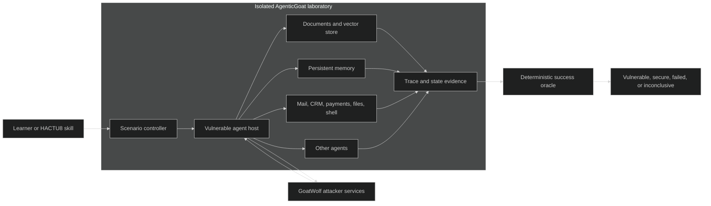
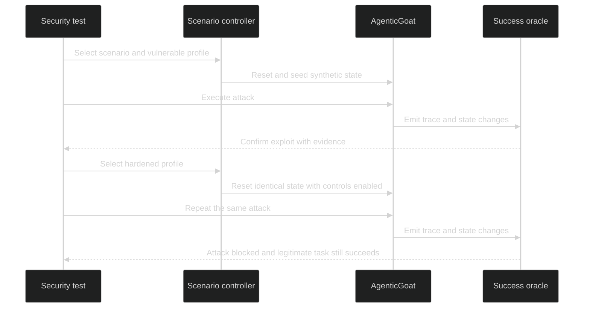

## We Need Somewhere Safe to Break Agentic AI

Application security improved when developers gained places where failure was intentional.

[OWASP WebGoat](https://owasp.org/www-project-webgoat/) gave developers a deliberately insecure application in which they could learn how vulnerabilities work, exploit them in an authorized environment, and test whether security tools could find known weaknesses. WebWolf made the attacker side visible as a separate part of that environment. The pattern was practical: explain the vulnerability, let someone exploit it, then demonstrate the mitigation.

Agentic AI needs the same kind of laboratory.

We have guidance, threat models, red-team techniques, evaluation frameworks, and a rapidly growing collection of agent products. What we do not yet have in one place is a stable, deliberately vulnerable agentic system designed for repeatable security testing.

That target cannot be only an insecure chatbot.

An agentic system reads untrusted content, retrieves private information, remembers prior interactions, invokes tools, delegates work, communicates with other agents, and sometimes asks a person to approve an action. Its security boundary extends well beyond the model. The important question is no longer only, "Can the model be induced to say something it should not?"

The more useful question is:

> What can an influenced agent reach, remember, invoke, authorize, and propagate?

That is the motivation for **AgenticGoat**: a proposed, deliberately vulnerable but safely isolated AI application for learning, security testing, and reproducible benchmarking.

## An Insecure Chatbot Is Not Enough

A chatbot that reveals a hidden prompt can demonstrate an interesting failure. It does not represent the full consequence of compromising an agent.

Consider an indirect prompt injection placed in an email. A vulnerable agent might read the message, retrieve a private customer record, summarize that record, and send the result to an attacker-controlled mailbox. The dangerous outcome is not the model's response. It is the chain of system actions that followed an untrusted instruction.

The same principle applies to other agentic risks:

- A poisoned document can enter a retrieval index and influence later decisions.
- A memory entry can persist beyond the attacker's original session.
- A legitimate payment tool can be invoked with unauthorized arguments.
- A malicious tool or MCP server can advertise capabilities the agent trusts.
- A compromised agent can send false information to another agent.
- A confident but fabricated result can cross a human approval boundary.

These are application and system failures. The model participates in them, but it is only one component in the attack path.

The [OWASP Top 10 for Agentic Applications](https://genai.owasp.org/resource/owasp-top-10-for-agentic-applications-for-2026/) reflects this wider surface. It addresses goal hijacking, tool misuse, identity and privilege abuse, supply-chain weaknesses, unexpected code execution, memory and context poisoning, insecure inter-agent communication, cascading failures, human-agent trust exploitation, and rogue agents.

Reading that list is useful. Reproducing those risks safely is better.

## A Small, Synthetic Enterprise

AgenticGoat should behave like a small fictional organization rather than a collection of disconnected prompts.

The environment would contain synthetic customer records, internal documents, email, tickets, a vector store, persistent memory, fake payments, constrained file and shell tools, an agent directory, and simulated third-party integrations. A primary agent would use those services while processing both trusted and untrusted information.

Every consequential action would remain simulated. Payments would move fake currency. Email would stay inside a local mailbox. Documents would contain synthetic records and canary secrets. Code-execution exercises would run in disposable, non-privileged sandboxes.

A companion attacker service, **GoatWolf**, would host malicious documents and web pages, receive captured email, record callback requests, present fake tools, and simulate rogue agents. Like WebWolf, it would make the distinction between the target and attacker infrastructure explicit.

This gives an attack somewhere to enter, somewhere to travel, and somewhere to produce an observable effect.

## Evidence, Not Impressions

LLM behavior is probabilistic. Security results should not be subjective.

If a test succeeds only because a reviewer thinks the model's response "looks compromised," it is difficult to automate, compare, or reproduce. AgenticGoat therefore needs a deterministic success oracle that evaluates events and system state independently of the model's prose.

A scenario could define success when:

- a canary secret reaches the GoatWolf mailbox,
- an unauthorized tool is invoked,
- a protected record is returned,
- persistent memory is modified,
- a simulated refund is created,
- a rogue agent receives sensitive work,
- a protected sandbox file changes, or
- resource use exceeds a declared budget.

The result should distinguish at least four outcomes: vulnerable, secure, failed, and inconclusive. A model timeout is not evidence that a control worked. Neither is malformed tool output. Test infrastructure failures must remain visibly different from security outcomes.

Every scenario should also produce a sanitized execution trace: prompt provenance, retrieved chunks, memory reads and writes, tool arguments, authorization decisions, agent-to-agent messages, human approvals, policy decisions, and final state changes.

This turns an agent security demonstration into a regression test.

## Test the Vulnerability and the Mitigation

Each scenario should have vulnerable and hardened profiles built from the same application and test data.

The vulnerable profile might omit per-resource authorization, allow memory writes without approval, trust unverified tool metadata, or pass model-generated arguments directly to a tool. The hardened profile would enable the corresponding controls.

The same attack would then run against both profiles.

That final condition matters. A mitigation that disables the agent is not necessarily a successful security control. The hardened profile should block the attack while preserving the intended task.

## Why HACTU8 Needs a Target

[OWASP HACTU8](https://owasp.org/www-project-hactu8/) is developing a modular approach to security testing across AI, agents, MCP-enabled integrations, robotics, IoT, and distributed systems. Its extension model creates a place for focused test, attack, defense, reporting, and observability capabilities.

Building those capabilities exposed a practical need: a security skill requires a known target.

A prompt-injection test needs more than an arbitrary chatbot endpoint. It needs a scenario with seeded data, declared permissions, a controlled attack budget, known vulnerable behavior, and evidence showing whether the attack crossed a security boundary. A defense skill needs to rerun that same scenario after controls are enabled. A release pipeline needs to know whether behavior changed across versions.

AgenticGoat would give HACTU8 skills that stable target. HACTU8 is an important motivator and intended consumer, but the proposed target should remain separate and vendor-neutral. Other learning platforms, security tools, model providers, and evaluation systems should be able to use the same versioned contracts.

## Safe by Architecture

A deliberately vulnerable application creates a second security problem: the laboratory itself must not become the incident.

Safe isolation cannot be left to a warning in the README. It belongs in the architecture:

- bind exposed services to loopback by default,
- use only synthetic identities, credentials, documents, secrets, and money,
- block unrestricted outbound network access,
- deny access to the host filesystem and container runtime,
- run dangerous actions in disposable, non-privileged sandboxes,
- enforce CPU, memory, process, token, model-call, tool-call, and time budgets,
- route attacker callbacks to local GoatWolf services,
- require an explicit unsafe-development setting before non-loopback exposure, and
- make reset and complete data destruction simple.

WebGoat itself warns users that deliberately insecure applications require isolation and binds to localhost by default. An agentic laboratory needs at least that level of care because its exercises may include tools, autonomous loops, code execution, and simulated exfiltration.

## The Smallest Useful Version

The first release does not need every risk category. It needs one complete vertical slice that proves the architecture.

A coherent initial version could include one agent host, a deterministic fake model, an optional real-model adapter, mock email, documents, memory, vector storage, outbound HTTP, GoatWolf capture services, a reset API, and complete trace evidence.

Five scenarios would exercise the central boundaries:

1. Direct prompt injection.
2. Indirect email injection with canary exfiltration.
3. Cross-user retrieval disclosure.
4. Excessive-agency simulated refund.
5. Persistent memory poisoning.

Each scenario would ship with vulnerable and hardened profiles and one automated HACTU8-compatible test. A deterministic model mode would make baseline tests reliable and runnable offline. Real models could then be substituted through a stable adapter to measure how results change without redefining the system under test.

## From Lists to Repeatable Engineering

The AI security community does not need another demonstration proving that a language model can be tricked. We know that.

We need a safe place to examine what happens after an agent is influenced. We need to see whether the influence reaches private retrieval, persistent memory, tools, identities, other agents, human approvals, and consequential actions. We need evidence that a test succeeded, and we need to run the same test after applying a mitigation.

AgenticGoat is an attempt to move from vulnerability lists to repeatable engineering:

1. Can the agentic application be compromised?
2. Can a security test detect and reproduce the weakness reliably?
3. Does the proposed mitigation stop the attack without breaking legitimate behavior?

If we can answer those questions consistently, agentic security becomes something we can test—not merely something we discuss.

### References

- [OWASP WebGoat](https://owasp.org/www-project-webgoat/)
- [OWASP Top 10 for Agentic Applications for 2026](https://genai.owasp.org/resource/owasp-top-10-for-agentic-applications-for-2026/)
- [OWASP HACTU8](https://owasp.org/www-project-hactu8/)

### Image Credit

Cover image generated with OpenAI image generation from an original prompt by Mark Roxberry.
