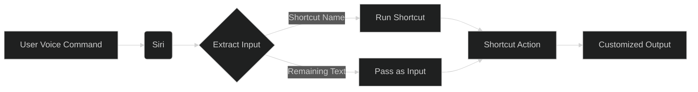

## The Idea: Siri as Your Proactive Assistant

With the introduction of Apple Intelligence, Siri is no longer just a reactive tool for setting timers or checking the weather. It's evolving into a proactive assistant that understands your context, your habits, and your needs. The real magic happens when you combine this intelligence with the power of the Shortcuts app.

### Implementation Ideas

To truly leverage Siri AI, we need to move beyond simple commands and start building integrated workflows. Here are a few ways to get started:

- **Contextual Automation:** Create shortcuts that trigger based on your location, the time of day, or even the focus mode you're in.
- **Voice-Driven Workflows:** Use Siri to trigger complex multi-step shortcuts. For example, a single command like "Start my workday" could open your essential apps, join your morning standup, and read your top emails.
- **App Integration:** Utilize third-party apps that support Siri and Shortcuts to bridge the gap between your Apple ecosystem and the other tools you use daily.

## Passing Context: Siri to Shortcuts

One of the most powerful features is the ability to pass context directly from your voice command into a Shortcut. By including specific details after the shortcut's name, Siri captures that text and passes it as "Shortcut Input" to the first action.

### Real-World Examples

- **Security Brief:** You say, "Security Brief for the London office." Siri passes "London office" to your shortcut, which then fetches and reads the latest security updates specific to that location.
- **Russian Topic:** You say, "Russian Topic latest news on the election." Siri passes "latest news on the election" to your shortcut, which searches your preferred news sources for that specific subject.
- **My Day:** You say, "My Day focus on afternoon meetings." Siri passes "afternoon meetings" to your shortcut, which filters your calendar and reminders to only show what's relevant for the afternoon.

### How It Works

## Expanding and Evangelizing

How do we take this to the next level? It's about sharing what works and inspiring others to automate their routines.

- **Share Your Shortcuts:** The Shortcuts community thrives on sharing. Publish your most useful shortcuts on forums, social media, or your own blog.
- **Build for Others:** Create shortcuts that solve common pain points for your friends, family, or colleagues.
- **Explore the Possibilities:** As Siri AI continues to evolve, keep experimenting with new features and integrations. The future of personal automation is just beginning.

## References

- [Apple Shortcuts User Guide](https://support.apple.com/guide/shortcuts/welcome/ios)
- [MacStories Shortcuts Archive](https://www.macstories.net/shortcuts/)

## Credits

### Image

- Cover image generated with Gemini image generation from an original prompt by Mark Roxberry.

## Note

*Disclaimer: Written using Siri and Shortcuts.*
